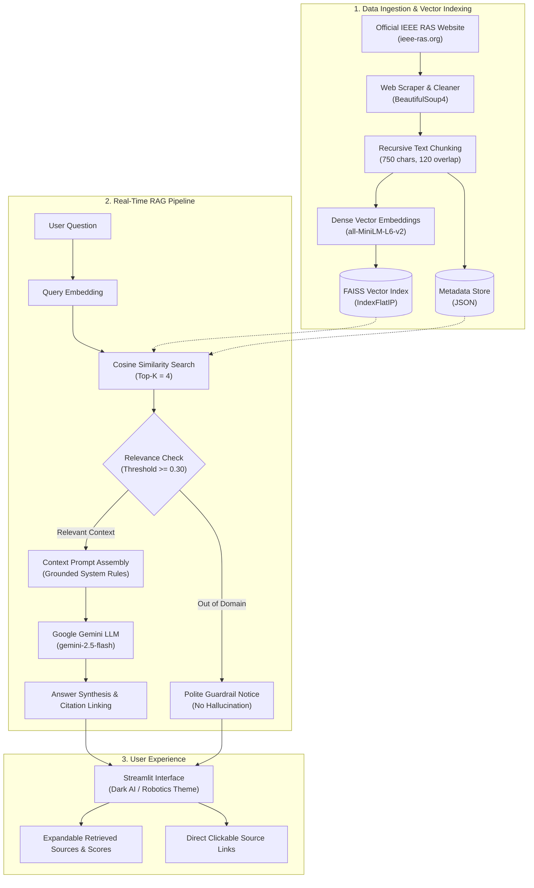

# IEEE RAS AI Knowledge Assistant

[](https://www.python.org/)
[](https://streamlit.io/)
[](https://github.com/facebookresearch/faiss)
[](https://ai.google.dev/)
[](LICENSE)

> A modern, retrieval-augmented intelligence assistant providing factually grounded answers about the **IEEE Robotics and Automation Society (IEEE RAS)** from official public records.

---

## Overview

The **IEEE RAS AI Knowledge Assistant** is an independent, community-developed Retrieval-Augmented Generation (RAG) system built to help researchers, students, and engineers navigate the IEEE Robotics and Automation Society (IEEE RAS) ecosystem. IEEE RAS sponsors flagship international conferences, publishes tier-1 journals, manages dozens of specialized technical committees, and offers student travel grants and educational initiatives worldwide.

Rather than relying on generic, ungrounded Large Language Model (LLM) responses that risk hallucinating dates, committees, and policies, this system retrieves authentic document excerpts from pre-indexed IEEE RAS documentation using semantic vector search before synthesizing an answer. 

Every response is strictly verified against retrieved context and includes transparent similarity scores, chunk excerpts, and direct, clickable citations back to official IEEE RAS web pages.

---

## System Architecture



---

## Features

- **Retrieval-Augmented Generation (RAG)**: Answers are generated dynamically from retrieved official IEEE RAS documentation rather than relying only on the LLM's parametric memory.
- **Strict Anti-Hallucination Guardrails**: Employs low-temperature sampling and explicit negative constraints. If a query is outside the scope of IEEE RAS (e.g., general trivia), the assistant clearly indicates that verified records do not contain the answer.
- **FAISS Vector Search**: Fast, memory-efficient similarity search using normalized inner product cosine similarity on dense 384-dimensional embeddings (`all-MiniLM-L6-v2`).
- **Verifiable Source Attribution**: Every response provides direct, clickable links to official IEEE RAS pages alongside an expandable inspection panel displaying cosine similarity percentages and retrieved excerpts.
- **Interactive Streamlit Web UI**: Polished dark robotics/AI interface featuring chat memory, quick question prompts, pipeline status indicators, and live telemetry.
- **Zero-Dependency Startup**: Includes a pre-computed vector index in the repository so cloud deployments (Render, Hugging Face Spaces) launch immediately without runtime scraping bottlenecks.

---

## Public IEEE RAS Data Sources

The knowledge base was compiled using public, non-restricted pages from [IEEE RAS](https://www.ieee-ras.org/):

| Category | Primary Topics | Official URL |
| :--- | :--- | :--- |
| **About & Mission** | Society overview, history, vision, and governance | [`/about-ras`](https://www.ieee-ras.org/about-ras) |
| **Technical Committees** | Agricultural, Humanoids, Autonomous Vehicles, Soft Robotics, Medical Robotics | [`/technical-committees`](https://www.ieee-ras.org/technical-committees) |
| **Conferences** | ICRA, IROS, CASE, BioRob, RO-MAN, ARSO | [`/conferences-workshops`](https://www.ieee-ras.org/conferences-workshops) |
| **Publications** | T-RO, T-ASE, RAM, RA-L, T-MRB | [`/publications`](https://www.ieee-ras.org/publications) |
| **Membership** | Member grades (Student, Senior, Fellow), benefits | [`/membership`](https://www.ieee-ras.org/membership) |
| **Students** | Travel grants, Student Branch Chapters, paper awards | [`/students`](https://www.ieee-ras.org/students) |
| **Education** | Seasonal schools, Distinguished Lecturer Program | [`/educational-resources`](https://www.ieee-ras.org/educational-resources) |
| **Awards** | Pioneer Award, Early Career Award, Inaba Innovation Award | [`/awards-recognition`](https://www.ieee-ras.org/awards-recognition) |
| **Chapters** | Global geographic sections and local activities | [`/chapters`](https://www.ieee-ras.org/chapters) |
| **Industry & Standards**| IEEE 1872 (CORA), IEEE 1873 map representation | [`/industry-activities`](https://www.ieee-ras.org/industry-activities) |

---

## Tech Stack

- **Language & Runtime**: Python 3.11+
- **Frontend Framework**: [Streamlit](https://streamlit.io/)
- **Large Language Model**: [Google Gemini](https://ai.google.dev/) (`gemini-2.5-flash` via `google-genai` SDK)
- **Vector Database**: [FAISS (Facebook AI Similarity Search)](https://github.com/facebookresearch/faiss)
- **Embedding Model**: [Hugging Face Sentence-Transformers](https://www.sbert.net/) (`all-MiniLM-L6-v2`)
- **Ingestion & Parsing**: BeautifulSoup4, Requests
- **Deployment Platform**: Render / Streamlit Cloud / Docker

---

## Project Structure

```
ieee-ras-rag-assistant/
├── app.py                     # Streamlit frontend & interactive chat interface
├── requirements.txt           # Pinned production dependencies
├── README.md                  # Project documentation & architecture
├── .gitignore                 # Excludes environments, secrets, and caches
├── .env.example               # Environment variables template
├── render.yaml                # Infrastructure-as-code for Render deployment
│
├── data/
│   ├── raw/                   # Raw ingested IEEE RAS documents
│   │   └── ieee_ras_raw_docs.json
│   └── processed/             # Cleaned and segmented text chunks
│       └── ieee_ras_chunks.json
│
├── vectorstore/
│   ├── index.faiss            # Pre-computed FAISS vector index (IndexFlatIP)
│   └── metadata.json          # Chunk metadata with titles and source URLs
│
├── scripts/
│   ├── scrape_data.py         # Web scraping & public content ingestion
│   └── build_index.py         # Embedding computation & FAISS index builder
│
├── src/
│   ├── __init__.py
│   ├── config.py              # Centralized configurations and prompts
│   ├── embeddings.py          # Sentence-transformer singleton wrapper
│   ├── retriever.py           # FAISS retrieval & cosine similarity scoring
│   ├── rag.py                 # RAG orchestration, prompt engineering & Gemini call
│   └── utils.py               # Text cleaning, chunking, and citation utilities
│
└── tests/
    ├── __init__.py
    └── test_pipeline.py       # Automated unit & integration test suite
```

---

## Running Locally

### 1. Clone the Repository
```bash
git clone https://github.com/your-username/ieee-ras-rag-assistant.git
cd ieee-ras-rag-assistant
```

### 2. Create and Activate a Virtual Environment
```bash
# On Linux / macOS:
python3 -m venv venv
source venv/bin/activate

# On Windows (PowerShell):
py -3 -m venv venv
venv\Scripts\Activate.ps1
```

### 3. Install Dependencies
```bash
pip install -r requirements.txt
```

### 4. Configure Environment Variables
Copy `.env.example` to `.env`:
```bash
cp .env.example .env
```
Open `.env` and add your Google Gemini API Key (obtain one free at [Google AI Studio](https://aistudio.google.com/app/apikey)):
```env
GEMINI_API_KEY=AIzaSy...your_api_key_here
GEMINI_MODEL=gemini-2.5-flash
```

*(Note: The app will still function in context-only preview mode even without an API key, and allows entering an API key directly in the sidebar.)*

### 5. Run the Application
```bash
streamlit run app.py
```
Open your browser at `http://localhost:8501`.

---

## Re-indexing the Knowledge Base (Optional)

The repository comes with the pre-computed index in `vectorstore/`. If you wish to re-scrape and rebuild the index from scratch:

```bash
# 1. Fetch public IEEE RAS web records
python scripts/scrape_data.py

# 2. Chunk text, compute embeddings, and build the FAISS index
python scripts/build_index.py
```

---

## Running Automated Tests

Run the comprehensive unit test suite:

```bash
python -m unittest discover -s tests -p "test_*.py"
```

The test suite validates:
- FAISS index integrity and metadata alignment
- Embedding normalization (Euclidean norm ≈ 1.0)
- Domain-specific retrieval for IEEE RAS, Technical Committees, and Conferences
- Out-of-domain rejection guardrails (e.g., geography queries)
- Graceful handling of empty or malformed queries

---

## Deployment on Render

This project is fully configured for zero-friction deployment on [Render](https://render.com/).

### Option A: Using `render.yaml` (Blueprint)
1. Push your repository to GitHub.
2. Log into [Render Dashboard](https://dashboard.render.com/).
3. Click **New +** → **Blueprint**.
4. Connect your GitHub repository.
5. In the Environment configuration screen, add your secret environment variable:
   - `GEMINI_API_KEY` = `<your-gemini-api-key>`
6. Click **Apply**. Render will automatically build and deploy the web service.

### Option B: Manual Web Service Setup
1. On Render, click **New +** → **Web Service**.
2. Connect your GitHub repository.
3. Configure the following fields:
   - **Name**: `ieee-ras-rag-assistant`
   - **Language**: `Python 3`
   - **Branch**: `main`
   - **Build Command**: `pip install -r requirements.txt`
   - **Start Command**: `streamlit run app.py --server.port $PORT --server.address 0.0.0.0 --server.headless true`
4. Under **Environment Variables**, add:
   - `GEMINI_API_KEY` = `<your-gemini-api-key>`
   - `PYTHON_VERSION` = `3.11.9`
5. Click **Create Web Service**.

---

## RAG & Retrieval Deep-Dive

1. **Embedding Model**: We utilize `all-MiniLM-L6-v2`, an efficient transformer model mapping sentences to a 384-dimensional dense vector space. Vectors are L2-normalized upon creation.
2. **Similarity Metric**: FAISS `IndexFlatIP` computes the inner product between the normalized query vector and stored document vectors. For normalized vectors, the inner product is mathematically identical to Cosine Similarity:
   $$\text{sim}(u, v) = \frac{u \cdot v}{\|u\|_2 \|v\|_2} = u \cdot v$$
3. **Thresholding & Relevance Guardrail**: A similarity score cutoff (`0.30`) discards low-confidence matches. If a user asks an unrelated query like *"What is the capital of France?"*, the highest score falls well below the threshold, and the assistant politely informs the user without invoking the LLM or hallucinating answers.
4. **Context Injection**: The top-$K$ most relevant text chunks are formatted with document titles and exact source URLs, and injected into the Gemini system prompt with strict factual boundaries.

---

## Limitations

- **Scope**: The knowledge base reflects publicly accessible pages from `ieee-ras.org`. It does not index login-protected IEEE member portals, full paywalled research papers, or internal administrative deliberations.
- **Dynamic Updates**: Changes to the live IEEE RAS website require re-running the build scripts (`scrape_data.py` and `build_index.py`) to reflect updated conference dates or award recipients.

---

## Disclaimer

> **Notice**: This is an independent, community-built educational project and is **not** an official IEEE or IEEE Robotics and Automation Society product or endorsement. All trademarks and society names belong to IEEE.
